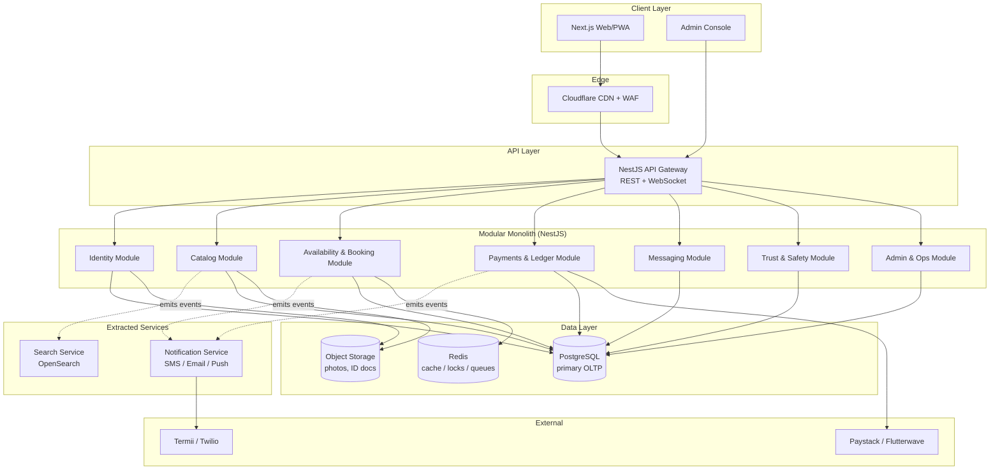
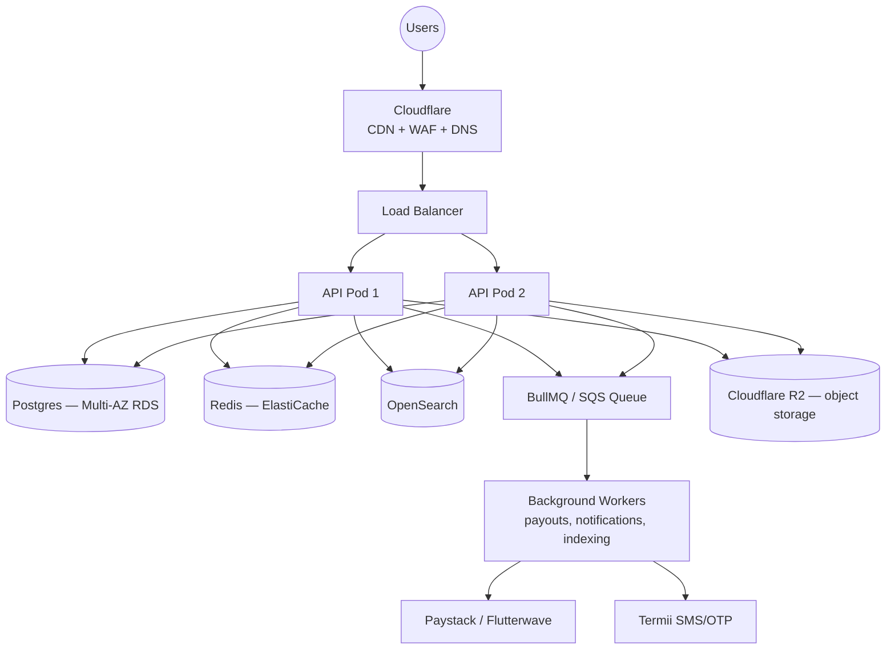

# Rently — System Architecture

> This document defines how Rently is built, not just what it does. Every choice below is made against three constraints that are easy to state and hard to satisfy together: **(1)** an MVP team of a handful of engineers must ship in months, not years, **(2)** the platform must survive going from 4 categories to 11+ and from hundreds to hundreds of thousands of listings without a rewrite, and **(3)** money and trust are on the line from day one — bookings, escrow payments, and identity verification cannot be "fixed later."

---

## 1. Architectural style: modular monolith first, not microservices-by-default

The instinctive "enterprise" answer is to split Rently into a dozen microservices from day one. That is the wrong call for this stage, and worth stating explicitly:

- A two-sided marketplace's hardest early problem is **liquidity and iteration speed** — getting providers and renters into a feedback loop fast. Distributed systems overhead (service discovery, network retries, distributed tracing, eventual consistency bugs) taxes exactly the velocity an MVP needs most.
- Bookings, payments, and availability are **transactionally coupled** — a booking must atomically check availability, hold funds, and lock a calendar slot. Splitting these into separate services on day one forces distributed transactions (sagas, 2PC) to solve a problem a single Postgres transaction solves for free.
- Stripe, Shopify, and early Airbnb all ran as monoliths well past their first several million dollars of GMV. They split by **domain boundary, only when a domain earned its own scaling or deployment profile** — not on a calendar.

**Decision:** Build a **modular monolith** in NestJS, organized into strict domain modules with no cross-module database access (only service-to-service calls through defined interfaces). This gives us microservice-grade separation of concerns on day one, with monolith-grade operational simplicity — and a clean extraction path when a module needs to scale independently.

### Domain modules (bounded contexts)

| Module | Owns | Extraction trigger (when to pull it out) |
|---|---|---|
| **Identity** | Auth, sessions, OTP, RBAC, provider verification | Rarely — stays in monolith long-term |
| **Catalog** | Listings, categories, category-attribute schemas, photos | When listing volume needs independent write scaling |
| **Search** | Indexing, faceted search, ranking | **First extraction candidate** — different read/write pattern (Elasticsearch, not Postgres) |
| **Availability & Booking** | Calendars, booking state machine, cancellation policy | Stays coupled to Payments as long as possible (shared transaction boundary) |
| **Payments & Ledger** | Escrow, commission, payouts, refunds | **Second extraction candidate** — compliance/PCI isolation benefits from a hard boundary |
| **Messaging** | In-app threads, notifications fan-out | Extract when WebSocket connection volume needs its own fleet |
| **Trust & Safety** | Reviews, reports, disputes | Stays in monolith |
| **Admin & Ops** | Moderation queues, analytics, audit log | Stays in monolith; reads from other modules' data via internal API, never direct DB access |



**Rule that keeps this honest:** modules communicate only through injected service interfaces and a domain event bus (in-process `EventEmitter2` at MVP, upgraded to Redis Streams/SQS when a module is extracted). No module imports another module's repository or ORM entity directly. This is what makes the later extraction a deployment change, not a rewrite.

---

## 2. Why these specific technology choices

| Layer | Choice | Why *this*, not the obvious alternative |
|---|---|---|
| Backend framework | **NestJS (TypeScript)** | Enforces the module boundaries above at the framework level (DI, guards, interceptors). Ships with a native microservices transport layer, so extracting a module later is a config change, not a rewrite. |
| Primary database | **PostgreSQL** | Bookings need ACID transactions and *native double-booking prevention* (see §4) — something a NoSQL store can't give us without building distributed locking by hand. |
| Category-specific fields | **JSONB column + per-category JSON Schema**, not Entity-Attribute-Value tables | EAV makes every query a self-join nightmare at 11+ categories. JSONB with `gin` indexing gives flexible schema *and* queryability, validated at the API boundary against a schema stored per category — so Admin can add a field to "Real Estate" without a migration. |
| Search | **OpenSearch (Elasticsearch-compatible)** | Postgres full-text search cannot cheaply do faceted filtering across heterogeneous category attributes + geo-radius + price range + availability in one query at scale. This is the first thing that should NOT live in the monolith's primary DB. |
| Cache / locks / queues | **Redis** | One dependency, three jobs: session/rate-limit cache, distributed lock for the booking race window (§4), and BullMQ-backed job queue for async work (payout batches, image processing, notification fan-out). |
| Object storage | **S3-compatible (Cloudflare R2 preferred)** | R2 has zero egress fees — meaningful at marketplace scale where every listing photo is served constantly. ID verification documents go in a separate private bucket with field-level encryption, never the public listings bucket. |
| Payments | **Adapter pattern over Paystack + Flutterwave** | Nigeria-first per the PRD, but the business logic (escrow state machine, commission calculation) is written against a `PaymentProviderPort` interface — swapping or adding a processor (Stripe for future diaspora/cross-border) never touches booking logic. |
| Frontend | **Next.js (App Router) + TypeScript + Tailwind + shadcn/ui + Framer Motion** | Category and listing pages are the SEO/conversion surface — they must be server-rendered for discovery. The booking flow is highly interactive — it needs client-side state. Next.js is the only mainstream option that does both well in one codebase. |
| Auth | **Clerk at MVP** → self-hosted (NestJS + Passport + JWT rotation) post-Series A | Buys months of engineering time on session management, OTP, social login, and NDPR-compliant data handling that isn't the differentiated part of Rently. Revisit only when per-seat auth cost or data-residency requirements demand it. |
| Realtime | **NestJS WebSocket Gateway (Socket.IO)** | In-app messaging (FR6) and live booking-status updates need push, not poll. Socket.IO's room model maps 1:1 onto "one room per booking conversation." |
| Infra region | **AWS af-south-1 (Cape Town)** behind **Cloudflare** | Nearest AWS region to Nigeria (~40–70ms vs 150ms+ to eu-west-1). Cloudflare in front handles edge caching of category/listing pages, image resizing, DDoS/WAF, and lets us add a second origin region later without touching DNS logic. |
| IaC | **Terraform** | Every environment (staging/prod) is defined in code and diffable in PRs — infra changes get the same review rigor as application code. |
| CI/CD | **GitHub Actions** | Lint + typecheck + test + build on every PR; auto-deploy `main` to staging; manual promotion gate to production with a required approval (see §7). |
| Observability | **OpenTelemetry → Grafana/Loki/Tempo (or Datadog if budget allows) + Sentry** | Distributed tracing from day one, even in the monolith — so the moment Search or Payments is extracted, trace continuity doesn't break. |

---

## 3. Non-functional targets (from PRD §10, made concrete)

| Requirement | PRD target | How the architecture delivers it |
|---|---|---|
| Search latency | < 2s | OpenSearch, not Postgres, for anything with a filter/sort |
| Page load | < 3s | SSR + CDN edge cache for category/listing pages; image CDN with responsive `srcset` |
| Uptime | 99.5%+ | Multi-AZ Postgres (managed RDS/Aurora), stateless API pods behind a load balancer, health-checked autoscaling group |
| PCI-DSS | Required | We never touch raw card data — Paystack/Flutterwave hosted fields/tokenization only; our DB stores tokens, not PANs |
| NDPR compliance | Required | ID verification docs encrypted at rest in an isolated bucket, access-logged, retention policy enforced by a scheduled job; data processing agreement with any sub-processor (payment, SMS) |
| Auditability | All booking/payment/dispute actions logged | Append-only `audit_log` table, written by a Postgres trigger on the relevant tables — not just application-level logging, which can be bypassed by a bug |

---

## 4. The three hardest technical problems, solved explicitly

### 4.1 Double-booking (two renters booking the same item for overlapping dates)

This is *the* correctness bug that destroys marketplace trust. It is solved at the **database constraint level**, not in application code, because application-level "check then write" always has a race window under concurrent requests:

```sql
CREATE EXTENSION IF NOT EXISTS btree_gist;

ALTER TABLE bookings
  ADD CONSTRAINT no_overlapping_bookings
  EXCLUDE USING gist (
    listing_id WITH =,
    during WITH &&
  ) WHERE (status IN ('confirmed', 'pending'));
```

`during` is a `tstzrange` column. Postgres itself rejects a second overlapping booking at insert time — atomically, under any concurrency level, with zero application locking code. The API layer catches the resulting constraint violation and returns a clean "these dates were just taken" error.

### 4.2 Payment race conditions & double-charging

Every booking/payment-mutating endpoint requires an **`Idempotency-Key` header** (Stripe's pattern, deliberately copied because it's the correct pattern). The key is stored with the request hash and response for 24h; a retried request with the same key returns the cached response instead of re-executing. This is what makes "user double-taps Pay because the network was slow" a non-event instead of a double charge.

### 4.3 Escrow correctness

Money is never "in the app" — it is tracked as **ledger entries**, not a mutable balance field:

```
escrow_transactions: id, booking_id, type (hold|release|refund|payout), amount_minor, currency, provider_ref, created_at
```

A provider's "available balance" is always a *computed sum* over ledger entries, never a stored, directly-updatable number. This is standard fintech practice for one reason: a stored balance can drift from reality under a bug or a race condition; a ledger can only be wrong if the sum of its immutable rows is wrong, which is far easier to audit and impossible to silently corrupt.

---

## 5. Scalability path (how this grows without a rewrite)

```
Stage 1 (MVP, 0–5k listings):     Single Postgres + Redis + monolith, single region
Stage 2 (5k–50k listings):        Read replicas for Postgres; Search extracted to OpenSearch;
                                   CDN-cached category pages; Redis cluster
Stage 3 (50k+ listings, national): Payments extracted as isolated service (compliance boundary);
                                   Notification service extracted; Postgres sharded by category
                                   or region if a single primary becomes the bottleneck
Stage 4 (multi-country):          Region-local API deployments behind global load balancing;
                                   currency/locale become first-class, not retrofitted
```

The point of the modular monolith is that **stages 2–3 are infrastructure changes to already-isolated modules**, not application rewrites — because the module boundaries (§1) were enforced from day one.

---

## 6. Security architecture

- **AuthN/Z:** JWT access tokens (short-lived, 15 min) + rotating refresh tokens; role-based guards (`Renter`, `Provider`, `ProviderStaff`, `Admin`, `SuperAdmin`) enforced at the controller level via NestJS decorators, never left to the frontend to hide a button.
- **Transport:** TLS everywhere, HSTS, Cloudflare WAF rules for common injection/scanning patterns.
- **Secrets:** No secrets in code or `.env` committed to the repo — pulled from a managed secrets store (AWS Secrets Manager / Doppler) at deploy time.
- **PII/ID documents:** Stored in a private bucket, encrypted with a key not shared with the general application encryption key, access-logged per read, auto-purged per a retention policy agreed with legal (NDPR requirement).
- **Rate limiting:** Redis-backed sliding window per IP + per user, tighter on auth/OTP endpoints specifically to prevent credential-stuffing and OTP-brute-force.
- **Input validation:** Every DTO validated with `class-validator` at the API boundary; category-specific listing attributes validated against their stored JSON Schema before persistence.
- **Dependency/Supply chain:** Automated `npm audit`/Dependabot in CI; no direct `curl | sh` installs in build pipelines.

---

## 7. CI/CD

```mermaid
graph LR
  PR[Pull Request] --> Lint[Lint + Typecheck]
  Lint --> Test[Unit + Integration Tests]
  Test --> Build[Build Docker Image]
  Build --> Preview[Deploy Preview Environment]
  Preview --> Review[Code Review + Manual QA]
  Review -->|merge to main| Staging[Auto-deploy to Staging]
  Staging --> Smoke[Automated Smoke Tests]
  Smoke -->|manual approval gate| Prod[Deploy to Production]
  Prod --> Monitor[Monitor: error rate, latency, booking success rate]
```



Production deploys are **never automatic on merge** — a required human approval gate sits between staging and production, because a bad deploy that breaks the booking or payment path is a trust incident, not just a bug.

---

## 8. Cloud architecture (MVP topology)



Everything above the data layer is **stateless and horizontally scalable** — API pods and workers can be added under load without coordination, because session state lives in Redis/JWT, not in-process memory.

---

## 9. What we are deliberately *not* building yet

Per PRD §7.2 and §15, and consistent with the architecture above:

- No microservices beyond Search (extracted for a real technical reason, not resume-driven design).
- No Kubernetes at MVP — a managed container platform (ECS Fargate or Render) is sufficient until team size and deployment frequency justify the operational overhead of k8s.
- No multi-region active-active — single-region with backups and a documented recovery runbook until national scale demands it.
- No native mobile apps — PWA first, per PRD assumption, because the API/architecture is identical either way; it's a frontend decision, not an architectural one.
