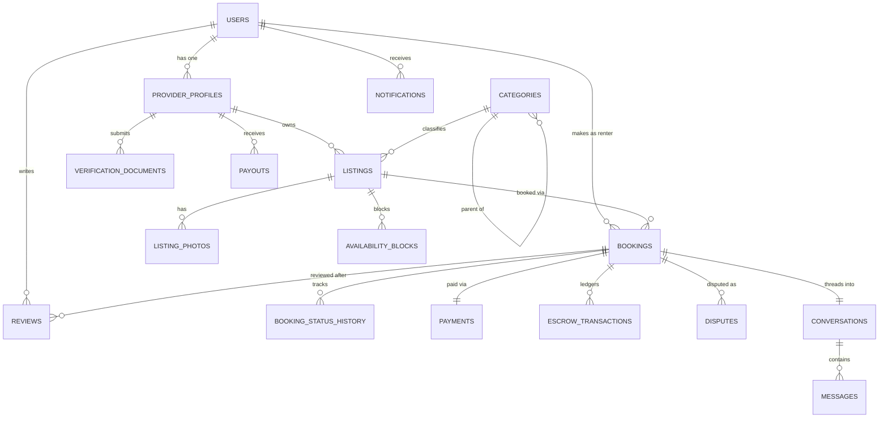

# Rently — Database Schema

PostgreSQL 15+. Money is always stored as **integer minor units** (kobo, not naira-as-float) to eliminate floating-point rounding bugs in financial calculations. Every mutable business entity carries `created_at`, `updated_at`, and (where deletion is possible) `deleted_at` for soft deletes — required for the audit trail in PRD §10.

## Entity-relationship overview



---

## Core tables

### `users`
| Column | Type | Notes |
|---|---|---|
| id | uuid PK | |
| email | citext unique | nullable if phone-only signup |
| phone | text unique | E.164 format |
| password_hash | text | null if social-login only |
| full_name | text | |
| roles | text[] | `{renter}`, `{provider}`, or both — a user can be both |
| email_verified_at | timestamptz | |
| phone_verified_at | timestamptz | |
| status | enum | `active`, `suspended`, `banned` |
| created_at / updated_at / deleted_at | timestamptz | |

### `provider_profiles`
| Column | Type | Notes |
|---|---|---|
| id | uuid PK | |
| user_id | uuid FK → users | |
| business_name | text | nullable for individual providers |
| business_registration_no | text | CAC number, nullable |
| verification_status | enum | `unverified`, `pending`, `verified`, `rejected` |
| verification_notes | text | admin-facing reason on rejection |
| avg_response_time_minutes | int | denormalized, recalculated nightly |
| avg_rating | numeric(2,1) | denormalized from `reviews`, recalculated on write |
| total_completed_bookings | int | denormalized |
| payout_schedule | enum | `weekly`, `on_completion` |
| created_at / updated_at | timestamptz | |

### `verification_documents`
| Column | Type | Notes |
|---|---|---|
| id | uuid PK | |
| provider_id | uuid FK → provider_profiles | |
| doc_type | enum | `id_card`, `cac_certificate`, `proof_of_address`, `liveness_video` |
| storage_key | text | private bucket key, never public |
| status | enum | `pending`, `approved`, `rejected` |
| reviewed_by | uuid FK → users (admin) | nullable |
| reviewed_at | timestamptz | |

### `categories`
| Column | Type | Notes |
|---|---|---|
| id | uuid PK | |
| parent_id | uuid FK → categories | nullable, self-referencing for subcategories |
| name | text | e.g. "Real Estate & Spaces" |
| slug | text unique | URL-safe |
| attribute_schema | jsonb | **JSON Schema** defining this category's custom listing fields (e.g. real estate requires `square_footage: number`, `lease_duration: enum`) |
| commission_rate_bps | int | basis points; allows per-category commission (PRD FR9.6) |
| is_active | boolean | admin can retire a category without deleting history |

> **Why JSONB + JSON Schema instead of an EAV table:** an Entity-Attribute-Value model (`attribute_id, listing_id, value`) makes every filtered search a multi-way self-join and loses type safety entirely. Storing category-specific fields as `listings.attributes jsonb`, validated against `categories.attribute_schema` at the API layer, gives Admins the ability to add a field to a category (PRD FR9.3) via data, not a migration — while a `GIN` index on `attributes` keeps it queryable.

### `listings`
| Column | Type | Notes |
|---|---|---|
| id | uuid PK | |
| provider_id | uuid FK → provider_profiles | |
| category_id | uuid FK → categories | |
| title | text | |
| description | text | |
| attributes | jsonb | category-specific fields, validated against `categories.attribute_schema` |
| price_minor | bigint | in kobo |
| price_unit | enum | `hour`, `day`, `week`, `month` |
| deposit_minor | bigint | nullable |
| location | geography(Point, 4326) | PostGIS — enables radius search |
| location_text | text | display string |
| condition | enum | `new`, `like_new`, `good`, `fair` |
| min_duration | int | in `price_unit`s |
| max_duration | int | |
| cancellation_policy | enum | `flexible`, `moderate`, `strict` |
| booking_mode | enum | `instant`, `request` |
| status | enum | `draft`, `pending_review`, `live`, `paused`, `rejected` |
| avg_rating | numeric(2,1) | denormalized |
| review_count | int | denormalized |
| created_at / updated_at / deleted_at | timestamptz | |

Indexes: `GIN (attributes)`, `GIST (location)`, `btree (category_id, status)` for browse queries.

### `listing_photos`
`id, listing_id FK, storage_key, position (int), created_at` — ordered by `position` for gallery display.

### `availability_blocks`
Providers manually blocking dates (maintenance, personal use — PRD FR2.5), distinct from booking-driven blocks:
`id, listing_id FK, during (tstzrange), reason (text), created_at`

### `bookings`
| Column | Type | Notes |
|---|---|---|
| id | uuid PK | |
| listing_id | uuid FK → listings | |
| renter_id | uuid FK → users | |
| during | tstzrange | rental period |
| status | enum | `pending`, `confirmed`, `declined`, `cancelled`, `completed`, `disputed` |
| booking_mode | enum | `instant`, `request` — copied from listing at booking time (listing settings can change later) |
| rental_fee_minor | bigint | price × duration, snapshotted |
| service_fee_minor | bigint | snapshotted — never recalculated retroactively if commission rates change |
| deposit_minor | bigint | snapshotted |
| total_minor | bigint | |
| cancellation_policy | enum | snapshotted from listing |
| idempotency_key | text unique | prevents duplicate booking creation on retry |
| created_at / updated_at | timestamptz | |

**Constraint (double-booking prevention, see `ARCHITECTURE.md` §4.1):**
```sql
ALTER TABLE bookings
  ADD CONSTRAINT no_overlapping_bookings
  EXCLUDE USING gist (listing_id WITH =, during WITH &&)
  WHERE (status IN ('confirmed', 'pending'));
```

### `booking_status_history`
Append-only audit trail: `id, booking_id FK, from_status, to_status, changed_by (uuid, nullable for system), reason, created_at`.

### `payments`
| Column | Type | Notes |
|---|---|---|
| id | uuid PK | |
| booking_id | uuid FK → bookings (unique) | |
| provider_processor | enum | `paystack`, `flutterwave` |
| processor_reference | text | external transaction ID |
| method | enum | `card`, `bank_transfer`, `mobile_money` |
| amount_minor | bigint | |
| status | enum | `initiated`, `held_in_escrow`, `released`, `refunded`, `failed` |
| idempotency_key | text unique | |

### `escrow_transactions`
Immutable ledger — **never updated, only inserted** (see `ARCHITECTURE.md` §4.3):
`id, booking_id FK, type (enum: hold|release|refund|payout), amount_minor, currency, provider_ref, created_at`

A provider's payable balance is `SUM(amount_minor) WHERE type='release' AND NOT paid_out` — always computed, never stored as a mutable field.

### `payouts`
`id, provider_id FK, amount_minor, status (enum: pending|processing|paid|failed), processor_reference, period_start, period_end, created_at`

### `reviews`
| Column | Type | Notes |
|---|---|---|
| id | uuid PK | |
| booking_id | uuid FK → bookings (unique per direction) | enforces "review tied to a completed booking" (PRD FR7.2) |
| author_id | uuid FK → users | |
| target_id | uuid FK → users | the person/provider being reviewed |
| direction | enum | `renter_to_provider`, `provider_to_renter` |
| rating | smallint | 1–5 |
| comment | text | |
| provider_response | text | nullable, providers can respond publicly |
| created_at | timestamptz | |

Unique constraint on `(booking_id, direction)` — one review per direction per booking.

### `conversations` / `messages`
`conversations: id, booking_id FK (nullable — pre-booking inquiries allowed), renter_id, provider_id, created_at`
`messages: id, conversation_id FK, sender_id, body, read_at, created_at`

### `disputes`
`id, booking_id FK, opened_by FK users, reason (enum), description, evidence_urls (text[]), status (enum: open|investigating|resolved), resolution (enum: refund_full|refund_partial|no_action|account_action), resolved_by FK users (admin), resolved_at`

### `notifications`
`id, user_id FK, type (enum), payload (jsonb), channel (enum: email|sms|push|in_app), read_at, sent_at, created_at`

### `audit_log`
Append-only, populated by database triggers (not just application code, so it can't be bypassed by a bug):
`id, actor_id, actor_type (user|admin|system), action, entity_type, entity_id, before (jsonb), after (jsonb), ip_address, created_at`

---

## Design decisions worth defending

1. **Snapshotting financial fields on `bookings`** (`rental_fee_minor`, `service_fee_minor` at time of booking) rather than always joining to `listings.price_minor` — because a provider changing their price tomorrow must never change what a renter agreed to pay for last week's booking.
2. **Ledger over balance** for escrow — a mutable `provider_profiles.balance_minor` column is the single most common source of "where did the money go" incidents in marketplace platforms; an append-only ledger makes that class of bug structurally impossible.
3. **PostGIS for location**, not lat/lng floats with manual haversine math — radius search (PRD FR3.2/FR3.4) is a solved problem in Postgres; reinventing it in application code is where bugs live.
4. **`tstzrange` + `EXCLUDE USING gist`** for both `bookings.during` and `availability_blocks.during` — the database is the single source of truth for "is this thing available," not a cache or application-level check that can race.
