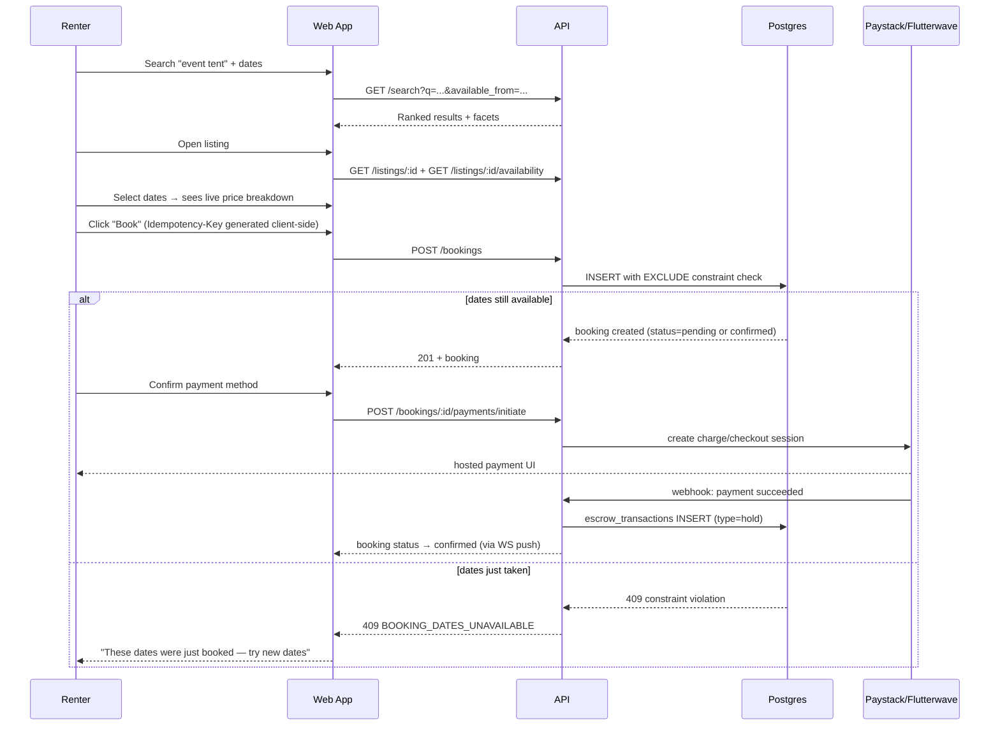

# Rently — Information Architecture & Key Flows

## Sitemap (route table)

Routes below map directly onto the Next.js App Router structure so this doc and `frontend/app/` never drift apart.

```
/                                  Home — hero search, categories, featured listings
/categories/[slug]                 Category landing (SEO-critical, server-rendered)
/search                            Filtered results (query params drive filters — shareable/bookmarkable URLs)
/listings/[id]                     Listing detail + booking widget
/checkout/[bookingId]              Payment step
/bookings/[id]/confirmation        Success state
/how-it-works
/become-a-provider                 Provider marketing + signup CTA

/auth/signup, /auth/login, /auth/verify-otp

/account                           Renter account shell
  /account/bookings
  /account/messages
  /account/favorites
  /account/profile

/provider                          Provider dashboard shell (role-gated)
  /provider/overview
  /provider/listings
  /provider/listings/new
  /provider/listings/[id]/edit
  /provider/calendar
  /provider/bookings
  /provider/earnings
  /provider/messages
  /provider/reviews
  /provider/verification

/admin                             Admin console shell (role-gated)
  /admin/providers/verification-queue
  /admin/listings/moderation-queue
  /admin/categories
  /admin/disputes
  /admin/analytics
  /admin/audit-log
```

Public, SEO-relevant routes (`/`, `/categories/*`, `/listings/*`) are server-rendered for discovery and conversion. Everything under `/account`, `/provider`, `/admin` is authenticated, client-heavy, and can be rendered as a protected SPA-like shell.

---

## Navigation model by role

| Role | Primary nav | Notable absence |
|---|---|---|
| **Guest / Renter** | Browse, How it Works, Become a Provider, Search | No dashboard links until signed in |
| **Provider** | Everything a Renter sees **plus** a persistent "Provider Dashboard" entry point | Providers are never forced out of the renter experience — many will also rent |
| **Admin** | Separate console, no renter-facing chrome at all | Admin is an operations tool, not a marketing surface — different information density is correct here |

---

## Key user flows

### Renter: Discover → Book → Pay



### Provider: Onboard → List → Get Booked → Get Paid

```
Sign up as Provider
  → Submit verification documents (ID + optional CAC)
  → Admin review (async, target <24h)
  → [Verified] Create listing (category → attributes validated against schema → photos → pricing → calendar)
  → Admin moderation queue → listing goes live
  → Booking request/instant booking notification (push + email + in-app)
  → Approve (if Request-to-Book) or auto-confirmed
  → Coordinate pickup/delivery via in-app messaging
  → Mark rental complete
  → Escrow release triggers on completion (or per cancellation-policy timing)
  → Payout on schedule (weekly or on-completion, provider's choice)
  → Review received, optional public response
```

### Dispute flow

```
Either party opens a dispute on a booking (reason + evidence) within the defined window
  → Admin dispute queue: reviews booking timeline, messages, evidence
  → Admin resolves: full refund | partial refund | no action | account action
  → Ledger entries written for any refund (never a direct balance edit)
  → Both parties notified; resolution + reasoning logged to audit_log
```

---

## Why URLs are designed this way

Search and category pages encode filter state in the **query string**, not client-only state — `/search?category=tools&price_max=50000` is bookmarkable, shareable, and indexable. A design that hides filter state in memory looks fine in a demo and quietly kills SEO and word-of-mouth sharing in production — a mistake worth naming and avoiding deliberately.
